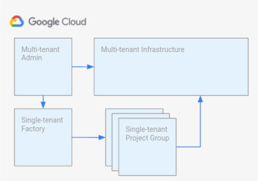

# Overview

Software delivery blueprint is a collection of best practice, Terraform and
templates that demonstrate how to build and manage a software delivery platform.
The overall goal of the platform described in this blueprint is to:

*   Enable self-service workflows for it's consumers (developers and application
operators)
*   Demonstrate a scalable way to manage shared infrastructure
*   Accomplish the above cost effeciently

This repository contains the code and templates that need to be split out into
different respositories for seperation of duties.  Creation of those repos is
done through helper scripts provide in this repo.

## Table of contents

## Architecture overview

The software delivery blueprint consists of four large components, multi-tenant/
shared infrastructure, multi-tenant administration tools, an application factory
and application/tenant projects.



These components are generally grouped into two categories: platform support and
software serving. The multi-tenant admin and single-tenant factory are
responsible for deploying and maintaining the infrastructure and projects used
to serve applications running on the platform.  The multi-tenant and
single-tenant infrastructure are used to serve one or more applications with the
goal of maximizing resource utilization and developer/operations efficiency.

### Multi-tenant admin

This is a GCP project that creates a set of projects, networks and other
infrastructure used for serving applications in a multi-tenant manner.

### Single-tenant factory (application factory)

This is a GCP project that application and operation teams use to create and
manage “Applications”.  “Applications” in the context of a software delivery
platform encompasses GCP projects used to run infrastructure specific to that
software, infrastructure as code pipelines and deployment pipelines.  The
factory could be extended to have additional projects which support individual
tenants for example an infrastructure as code generator.

### Multi-tenant infrastructure

The multi-tenant infrastructure component comprises GCP projects and
infrastructure (GKE, databases, etc.) that are used by multiple applications.
The goal of the multi-tenant infrastructure is to improve efficiency in terms of
operational overhead, resource utilization (cost) and consistency between
environments (development, staging and production).

### Single-tenant project groups

Single-tenant project groups are used to support a single application.  These
groups include projects for each environment containing infrastructure unique to
the application for example: GCS buckets, pub/sub, databases, etc. The
single-tenant project group component also includes tooling specific to that
single application: infrastructure as code and deployment pipelines.

## Directory contents

The following table contains a brief description of the code contained in each
directory.  For a more detailed description visit the README of the respective
directory.

| Directory                                      | Description
| ---------------------------------------------- | ----------
| [`acm-template`](acm-template)                 | If using Anthos Config Management (ACM), this directory contains the template used to initialize the ACM repo.
| [`app-factory-template`](app-factory-template) | App factory contains the Terraform specifying the applications and teams deployed on the software delivery platform.
| [`app-template-golang`](app-template-golang)   | Starter application for Golang applications
| [`app-template-java`](app-template-java)       | Starter application for Java applications
| [`evn-template`](evn-template)                 | Template used create the repo for each application's rendered configuration.
| [`infra-template`](infra-template)             | Template used to initialize each application's infrastructure as code repository.
| [`launch-scripts`](launch-scripts)             | Helper scripts used to deploy the software delivery blueprint.
| [`platform-template`](platform-template)       | Platform template contains the Terraform to create the multi-tenant infrasture supporting application deployment.
| `resources`                                    | Images and other resources used in documentation.
| [`terraform-modules`](terraform-modules)       | Terraform modules that are used by application and platform teams when creating infrastructure.

## Licensing

```lang-none
Copyright 2022 Google LLC

Licensed under the Apache License, Version 2.0 (the "License");
you may not use this file except in compliance with the License.
You may obtain a copy of the License at

    https://www.apache.org/licenses/LICENSE-2.0

Unless required by applicable law or agreed to in writing, software
distributed under the License is distributed on an "AS IS" BASIS,
WITHOUT WARRANTIES OR CONDITIONS OF ANY KIND, either express or implied.
See the License for the specific language governing permissions and
limitations under the License.
```

## Usage

Copyright 2022 Google. This software is shared as sample code and not intended
for production use and provided as-is, without warranty or representation for
any use or purpose. Your use of it is discretionary and subject to your
agreement with Google.

## Contributing

*   [Contributing guidelines][contributing-guidelines]
*   [Code of conduct][code-of-conduct]

<!-- LINKS: https://www.markdownguide.org/basic-syntax/#reference-style-links -->

[contributing-guidelines]: CONTRIBUTING.md
[code-of-conduct]: code-of-conduct.md
[acm-template]: acm-template/README.md
[app-factory-template]: app-factory-template/README.md
[app-template-golang]: app-template-golang/README.md
[app-template-java]: app-template-java/README.md
[evn-template]: evn-template/README.md
[infra-template]: infra-template/README.md
[launch-scripts]: launch-scripts/README.md
[platform-template]: platform-template/README.md
[terraform-modules]: terraform-modules/README.md